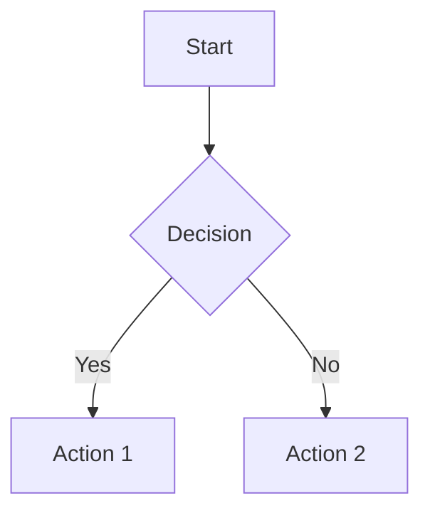

# Documentation Guidelines

**Project:** Interact - Employee Engagement & Gamification Platform  
**Last Updated:** January 16, 2026  
**Version:** 1.0.0

## Overview

This guide defines the standards, practices, and workflows for maintaining high-quality documentation in the Interact platform. Following these guidelines ensures our documentation remains accurate, accessible, and valuable for all stakeholders.

---

## 📐 Documentation Principles

### 1. Audience-Centric
- Write for specific personas (developers, product managers, end-users)
- Use appropriate technical level for the audience
- Provide clear examples and use cases

### 2. Documentation as Code
- Store docs alongside source code in version control
- Update documentation with every code change
- Review documentation in pull requests
- Use markdown for consistency

### 3. Living Documentation
- Keep documentation current with the product
- Regular review cycles (see maintenance schedule)
- Remove or update outdated content
- Mark deprecated features clearly

### 4. Clear and Concise
- Use simple, direct language
- Keep paragraphs short (3-5 sentences)
- Use bullet points and lists
- Avoid jargon unless necessary

### 5. Discoverable and Structured
- Maintain clear navigation and table of contents
- Use consistent naming conventions
- Cross-link related documents
- Organize by topic and audience

---

## 📁 Documentation Structure

### Root Directory Documentation
Files in the root directory should be high-level, strategic, or frequently accessed:
- README.md
- CONTRIBUTING.md
- CHANGELOG.md
- LICENSE

### Organized Documentation (`/docs/`)
Detailed documentation organized by topic:

```
docs/
├── index.md                    # Central navigation hub
├── getting-started/            # Onboarding guides
├── architecture/               # System design
├── api/                        # API documentation
├── guides/                     # How-to guides
├── security/                   # Security documentation
└── reference/                  # Reference materials
```

### Technical Documentation (`/components/docs/`)
Deep technical documentation for implementation details:
- Architecture specifications
- Database schemas
- API references
- Component documentation

### Architectural Decision Records (`/ADR/`)
Document significant architectural decisions:
- ADR-NNN-descriptive-name.md format
- Immutable records (don't edit after approval)
- Include context, decision, and consequences

---

## ✍️ Writing Standards

### Document Structure

Every documentation file should include:

```markdown
# Document Title

**Project:** Interact - Employee Engagement & Gamification Platform  
**Last Updated:** YYYY-MM-DD  
**Version:** X.Y.Z  
**Owner:** Role/Team

## Overview
Brief description of the document's purpose

## Table of Contents
- [Section 1](#section-1)
- [Section 2](#section-2)

## Content Sections
...

## References
Links to related documents

---
**Last Updated:** YYYY-MM-DD  
**Maintained by:** Team/Person
```

### Headings
- Use # for title (one per document)
- Use ## for main sections
- Use ### for subsections
- Use #### sparingly for sub-subsections
- Keep heading hierarchy logical

### Code Blocks
Always specify the language:

```javascript
// JavaScript example
const example = 'Use syntax highlighting';
```

```bash
# Bash commands
npm run dev
```

### Links
- Use relative links for internal documentation
- Use absolute URLs for external resources
- Link to specific sections when helpful
- Keep link text descriptive

```markdown
[Contributing Guidelines](./CONTRIBUTING.md)
[Section Name](#section-name)
[GitHub Best Practices](https://github.com/example)
```

### Images and Diagrams
- Store images in `/docs/images/` or related subdirectories
- Use Mermaid.js for diagrams when possible (renders in markdown)
- Provide alt text for accessibility
- Keep file sizes reasonable (<500KB)

Example Mermaid diagram:



---

## 🎯 Documentation Types

### 1. Tutorials (Learning-Oriented)
**Purpose:** Guide users through learning a concept step-by-step

**Structure:**
- Clear learning objectives
- Step-by-step instructions
- Code examples that work
- Expected outcomes
- Next steps

**Example:** Quick Start Guide, Getting Started Tutorial

### 2. How-To Guides (Task-Oriented)
**Purpose:** Show how to accomplish specific tasks

**Structure:**
- Problem statement
- Prerequisites
- Step-by-step solution
- Troubleshooting tips
- Related tasks

**Example:** How to Deploy, How to Add a Feature

### 3. Reference (Information-Oriented)
**Purpose:** Provide technical descriptions and specifications

**Structure:**
- Systematic organization
- Complete coverage
- Technical accuracy
- Minimal explanation
- Searchable format

**Example:** API Reference, Configuration Reference

### 4. Explanation (Understanding-Oriented)
**Purpose:** Clarify and illuminate concepts

**Structure:**
- Context and background
- Concepts explanation
- Design decisions
- Trade-offs
- Related concepts

**Example:** Architecture Overview, Design Philosophy

---

## 📝 Documentation Checklist

Before submitting documentation:

- [ ] Document has clear title and metadata
- [ ] Last updated date is current
- [ ] Table of contents included (if >200 lines)
- [ ] All links work and point to correct locations
- [ ] Code examples are tested and work
- [ ] Grammar and spelling checked
- [ ] Consistent formatting throughout
- [ ] Images/diagrams have alt text
- [ ] Related documents are cross-linked
- [ ] Audience-appropriate language used
- [ ] No sensitive information (credentials, secrets)
- [ ] Reviewed by at least one other person

---

## 🔄 Maintenance Schedule

### Regular Reviews

| Documentation Type | Review Frequency | Trigger |
|-------------------|------------------|---------|
| README | Monthly | Major feature release |
| Codebase Audit | Quarterly | Code changes |
| PRD | Quarterly | Strategy changes |
| Feature Roadmap | Monthly | Feature completion |
| Technical Docs | As-needed | Implementation |
| Security Docs | Quarterly | Security incidents |
| API Reference | Per release | API changes |
| ADRs | Never (immutable) | New decision = new ADR |

### Update Process

1. **Identify outdated content** during reviews
2. **Create issue** for documentation update
3. **Assign owner** to update
4. **Make changes** following guidelines
5. **Peer review** before merging
6. **Update "Last Updated" date**
7. **Announce** significant documentation changes

---

## 🚀 CI/CD Integration

### Automated Checks
- Markdown linting (markdownlint)
- Spell checking
- Broken link detection
- File naming validation

### Documentation Tests
- Verify code examples compile/run
- Check all internal links
- Validate markdown structure
- Ensure no sensitive data

### Documentation Preview
- Generate documentation preview in PRs
- Review rendered output before merging
- Test navigation and search

---

## 🎨 Style Guide

### Voice and Tone
- **Active voice:** "Run the command" not "The command should be run"
- **Present tense:** "The system sends" not "The system will send"
- **Second person:** "You can configure" not "One can configure"
- **Direct:** Avoid phrases like "please note that", "it should be noted"

### Terminology
- Use terms from [GLOSSARY.md](./GLOSSARY.md)
- Be consistent with terminology
- Define acronyms on first use
- Avoid jargon when possible

### Formatting
- **Bold** for UI elements, important terms
- *Italic* for emphasis
- `Code` for inline code, filenames, commands
- > Blockquotes for important notes

### Lists
- Use bullet points for unordered lists
- Use numbered lists for sequential steps
- Keep list items parallel in structure
- Don't end list items with periods (unless full sentences)

---

## 🛠️ Tools and Resources

### Documentation Tools
- **Markdown Editor:** VS Code with Markdown extensions
- **Diagram Tool:** Mermaid.js (embedded in markdown)
- **Spell Checker:** VS Code spell checker extension
- **Link Checker:** markdown-link-check
- **Linter:** markdownlint

### Useful Extensions
- Markdown All in One (VS Code)
- Markdown Preview Enhanced (VS Code)
- Code Spell Checker (VS Code)
- Mermaid Preview (VS Code)

### Reference Resources
- [Write the Docs](https://www.writethedocs.org/)
- [Google Developer Documentation Style Guide](https://developers.google.com/style)
- [Microsoft Writing Style Guide](https://docs.microsoft.com/en-us/style-guide/)
- [Diataxis Documentation Framework](https://diataxis.fr/)

---

## 📊 Documentation Metrics

### Quality Metrics
- **Coverage:** All features documented
- **Freshness:** Last updated within 3 months
- **Accuracy:** No reported errors
- **Completeness:** All sections filled
- **Accessibility:** Passes WCAG 2.1 AA

### Usage Metrics
- Most viewed pages
- Search queries
- Support tickets related to docs
- Contributor feedback

### Success Criteria
- 95%+ of features documented
- 90%+ of docs updated quarterly
- <5 documentation-related support tickets per month
- 4.5/5+ satisfaction rating from users

---

## 🤝 Contributing to Documentation

### Getting Started
1. Read this guide
2. Review existing documentation
3. Follow [CONTRIBUTING.md](./CONTRIBUTING.md)
4. Choose a documentation task

### Making Changes
1. Create a branch: `docs/descriptive-name`
2. Make your changes following guidelines
3. Test all code examples
4. Check links and formatting
5. Update "Last Updated" date
6. Submit pull request

### Pull Request Requirements
- Clear description of changes
- Link to related issues
- Screenshots if visual changes
- Checklist completed
- At least one approval

---

## 🆘 Getting Help

### Questions About Documentation
- Open an issue with `documentation` label
- Ask in team chat #documentation channel
- Review examples in existing docs

### Reporting Documentation Issues
- Typos, errors: Quick fix PR
- Outdated content: Create issue
- Missing docs: Create issue with details
- Unclear content: Create issue with questions

---

## 📋 Templates

### New Documentation Template

```markdown
# Document Title

**Project:** Interact - Employee Engagement & Gamification Platform  
**Last Updated:** YYYY-MM-DD  
**Version:** 1.0.0  
**Owner:** Role/Team

## Overview

Brief description (2-3 sentences).

## Table of Contents
- [Section 1](#section-1)
- [Section 2](#section-2)

## Section 1

Content...

## Section 2

Content...

## References

- [Related Doc 1](./related-doc-1.md)
- [External Resource](https://example.com)

---

**Last Updated:** YYYY-MM-DD  
**Maintained by:** Team/Person
```

### ADR Template

```markdown
# ADR-NNN: Descriptive Title

**Status:** Proposed | Accepted | Deprecated | Superseded  
**Date:** YYYY-MM-DD  
**Deciders:** Names  
**Technical Story:** Link to issue/ticket

## Context and Problem Statement

What is the issue we're seeing that is motivating this decision?

## Decision Drivers

- Driver 1
- Driver 2
- Driver 3

## Considered Options

1. Option 1
2. Option 2
3. Option 3

## Decision Outcome

Chosen option: "Option X", because [justification].

### Positive Consequences

- Benefit 1
- Benefit 2

### Negative Consequences

- Drawback 1
- Drawback 2

## Pros and Cons of the Options

### Option 1

Description...

- Good, because...
- Bad, because...

### Option 2

Description...

- Good, because...
- Bad, because...

## Links

- [Related ADR](./NNN-related-adr.md)
- [External Reference](https://example.com)
```

---

## 🔐 Security Considerations

### Sensitive Information
**Never include in documentation:**
- API keys, tokens, passwords
- Production credentials
- Private keys or certificates
- Internal infrastructure details
- Unpatched security vulnerabilities
- Customer data or PII

### Security Documentation
- Store in `/docs/security/` with appropriate access
- Follow [Vulnerability Disclosure](./docs/security/VULNERABILITY_DISCLOSURE.md)
- Review security docs quarterly
- Use placeholders for sensitive examples

---

## 📚 Quick Reference

### Common Tasks

| Task | Command/Action |
|------|---------------|
| Create new doc | Use template, add to index.md |
| Update existing | Edit file, update date, submit PR |
| Add diagram | Use Mermaid.js in code block |
| Link to doc | `[Text](./path/to/doc.md)` |
| Link to section | `[Text](./doc.md#section)` |
| Add code example | Use ``` with language |
| Add image | `` |
| Mark as WIP | Add `[WIP]` to title |
| Deprecate doc | Add deprecation notice, link to replacement |

### Keyboard Shortcuts (VS Code)
- Preview: `Ctrl/Cmd + Shift + V`
- Bold: `Ctrl/Cmd + B`
- Italic: `Ctrl/Cmd + I`
- Link: `Ctrl/Cmd + K`
- Format Document: `Shift + Alt + F`

---

## 📦 Documentation Versioning

### Version Strategy

Documentation should be versioned alongside code releases:

**Version Format:** `MAJOR.MINOR.PATCH`
- **MAJOR:** Significant documentation restructure
- **MINOR:** New sections or substantial updates
- **PATCH:** Small fixes, typos, clarifications

### Version Management

- Update version in document header when making significant changes
- Keep a changelog within each major document
- Archive old versions in `/docs/archive/vX.X/` when superseded
- Link to version history from current document

### Release Documentation

When creating a release:
1. Tag documentation version matching code version
2. Generate PDF/HTML archives for offline use
3. Update all "Version" fields in document headers
4. Create release notes summarizing documentation changes

---

## ♿ Accessibility Standards

All documentation must be accessible to users with disabilities:

### WCAG 2.1 Level AA Compliance

**Text Requirements:**
- Use semantic HTML headings (h1, h2, h3) in proper order
- Maintain 4.5:1 contrast ratio for text
- Use descriptive link text (not "click here")
- Avoid using color alone to convey information

**Images and Diagrams:**
- Provide alt text for all images
- Use descriptive captions
- Ensure diagrams have text descriptions
- Consider dark mode compatibility

**Code Examples:**
- Use syntax highlighting for readability
- Provide text alternatives for ASCII art
- Ensure examples work with screen readers

**Navigation:**
- Table of contents for documents >200 lines
- Skip navigation links for long pages
- Breadcrumb trails for nested documentation

---

## 🌍 Internationalization (i18n)

### Current Status
- English (US) is primary language
- Future: Multi-language support planned

### i18n Best Practices

**When Writing:**
- Use clear, simple English
- Avoid idioms and cultural references
- Use consistent terminology (see GLOSSARY.md)
- Keep sentences short and direct
- Use active voice

**Preparing for Translation:**
- Mark all user-facing text for translation
- Separate text from code examples
- Use ICU message format for complex strings
- Document cultural considerations
- Maintain translation glossary

**Translation Process (Future):**
1. Extract translatable strings
2. Send to translation service
3. Review translations for accuracy
4. Test with native speakers
5. Deploy translated versions

---

## 📊 Documentation Analytics

### Metrics to Track

**Usage Metrics:**
- Most viewed pages
- Average time on page
- Search queries (what users look for)
- Feedback ratings ("Was this helpful?")
- Support tickets referencing docs

**Quality Metrics:**
- Documentation coverage (% features documented)
- Freshness (last update date)
- Completeness (all sections filled)
- Accuracy (reported errors)
- Accessibility score (WCAG compliance)

### Improvement Process

1. **Analyze metrics** monthly
2. **Identify gaps** in coverage or clarity
3. **Prioritize updates** based on impact
4. **Implement changes** following guidelines
5. **Measure improvement** with follow-up metrics

---

## 🔗 Link Management

### Internal Links
- Use relative paths for repository links
- Check links before committing
- Update links when files move
- Document redirects in CHANGELOG

### External Links
- Verify links work before publishing
- Use permalinks when available
- Archive important external content
- Note when links might break (e.g., beta docs)

### Link Checking
```bash
# Install markdown-link-check
npm install -g markdown-link-check

# Check all markdown files
find . -name "*.md" -exec markdown-link-check {} \;
```

---

## 🎯 Future Improvements

Planned enhancements to documentation system:

- [ ] Automated documentation generation from code (JSDoc → Markdown)
- [ ] Interactive API documentation (Swagger/OpenAPI integration)
- [ ] Video tutorials for complex features
- [x] Documentation versioning per release (Added January 2026)
- [ ] Multi-language support (i18n framework ready)
- [ ] AI-powered documentation assistant
- [ ] Real-time documentation search
- [ ] Community contribution portal
- [x] Accessibility standards (WCAG 2.1 AA compliance documented)
- [ ] Dark mode support for diagrams
- [ ] Documentation feedback widget
- [ ] Estimated reading time indicators
- [ ] Interactive code playgrounds
- [ ] Mobile-optimized documentation viewer

---

## 📞 Contact

**Documentation Owner:** Product Team  
**Technical Writer:** TBD  
**Questions:** Open an issue with `documentation` label

---

**Last Updated:** January 21, 2026
**Maintained by:** Krosebrook
**Version:** 1.1.0
