# Architecture Overview (Visual)

**Project:** Interact - Employee Engagement & Gamification Platform  
**Last Updated:** January 16, 2026  
**Version:** 1.0.0

## Overview

This document provides visual diagrams of the Interact platform architecture using Mermaid.js.

---

## System Architecture

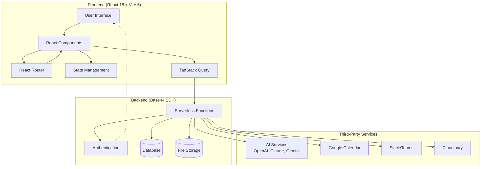

---

## Application Flow

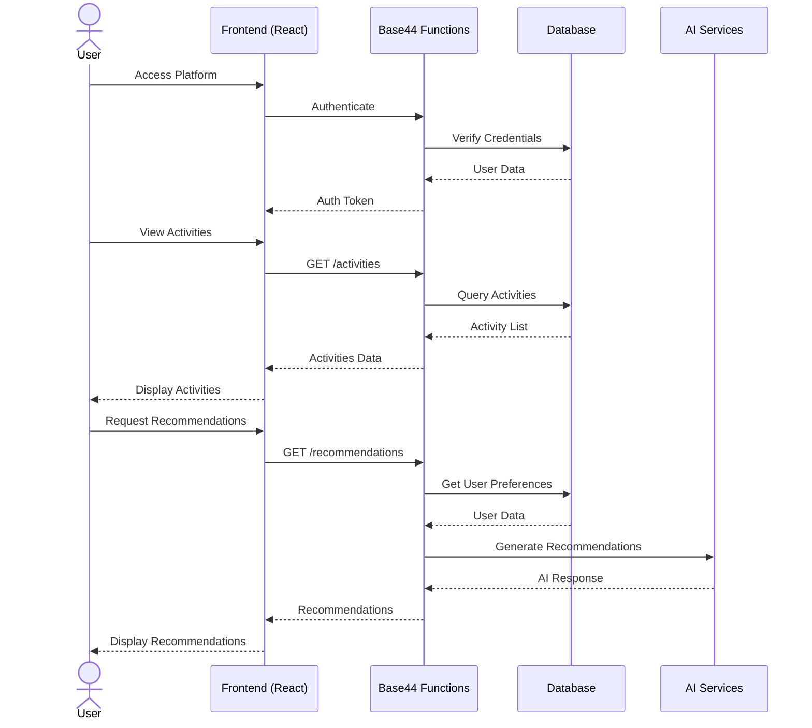

---

## Data Flow

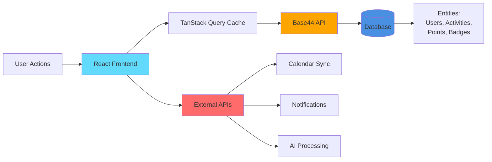

---

## Component Hierarchy

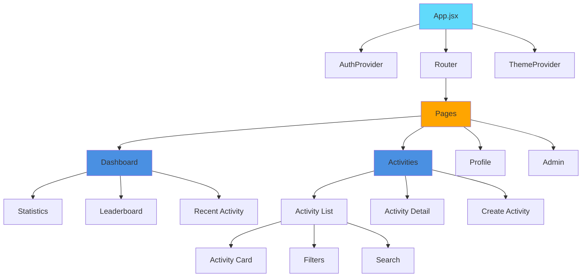

---

## Authentication Flow

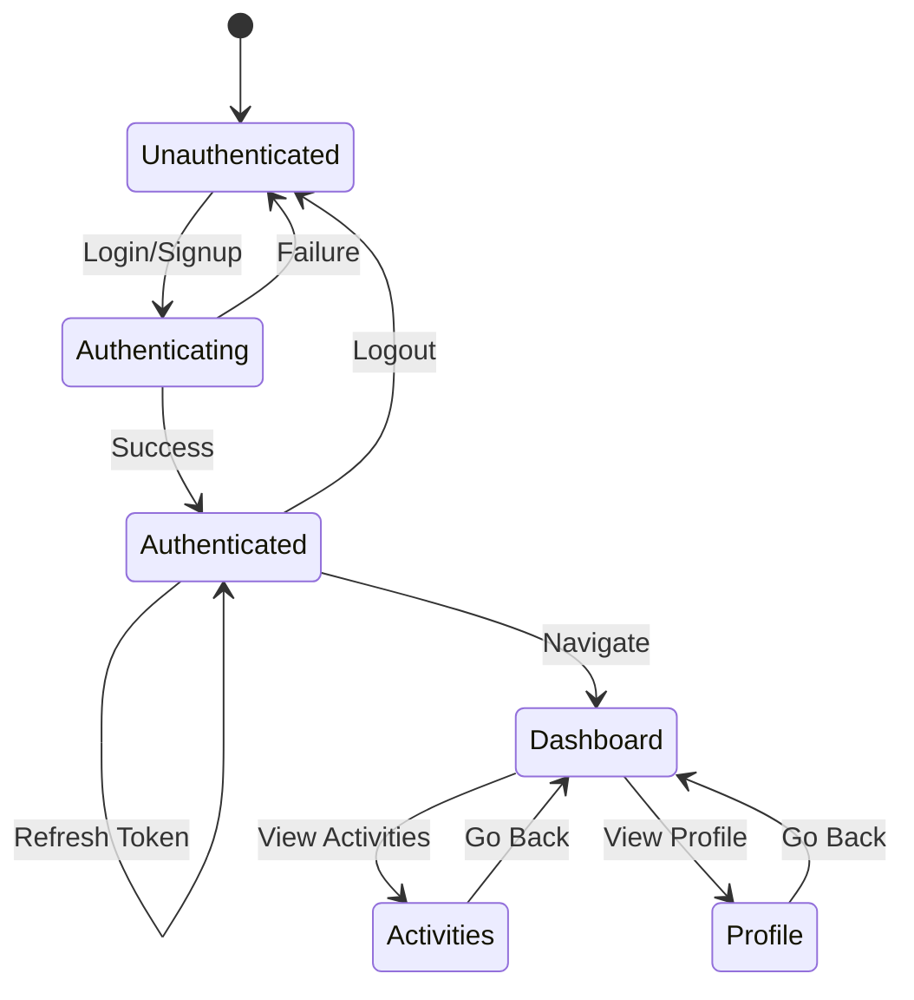

---

## Gamification System

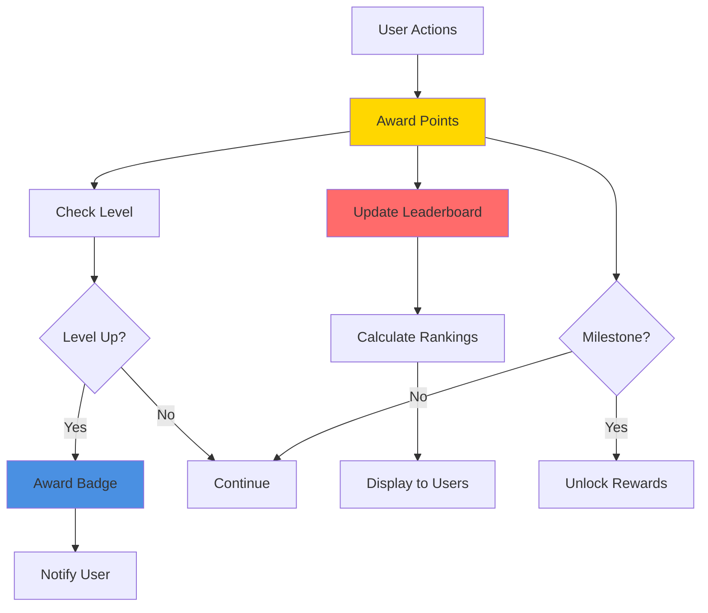

---

## Activity Lifecycle

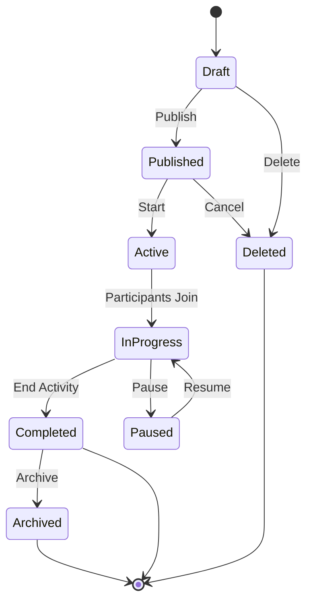

---

## Feature Module Structure

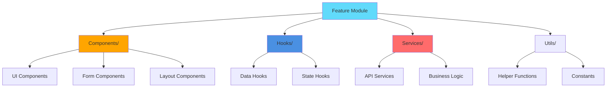

---

## Deployment Pipeline

```mermaid
graph LR
    Dev[Development] --> Commit[Git Commit]
    Commit --> PR[Pull Request]
    PR --> Tests[Run Tests]
    Tests --> Lint[Lint & Format]
    Lint --> Build[Build]
    Build --> Review[Code Review]
    Review --> Merge[Merge to Main]
    Merge --> Deploy[Deploy]
    
    Deploy --> Staging[Staging Environment]
    Staging --> Verify[Verification]
    Verify --> Production[Production]
    
    Production --> Monitor[Monitoring]
    Monitor --> Rollback{Issues?}
    Rollback -->|Yes| Staging
    Rollback -->|No| Success[Success]
    
    style Tests fill:#61dafb
    style Build fill:#ffa500
    style Production fill:#4a90e2
```

---

## Database Schema (High-Level)

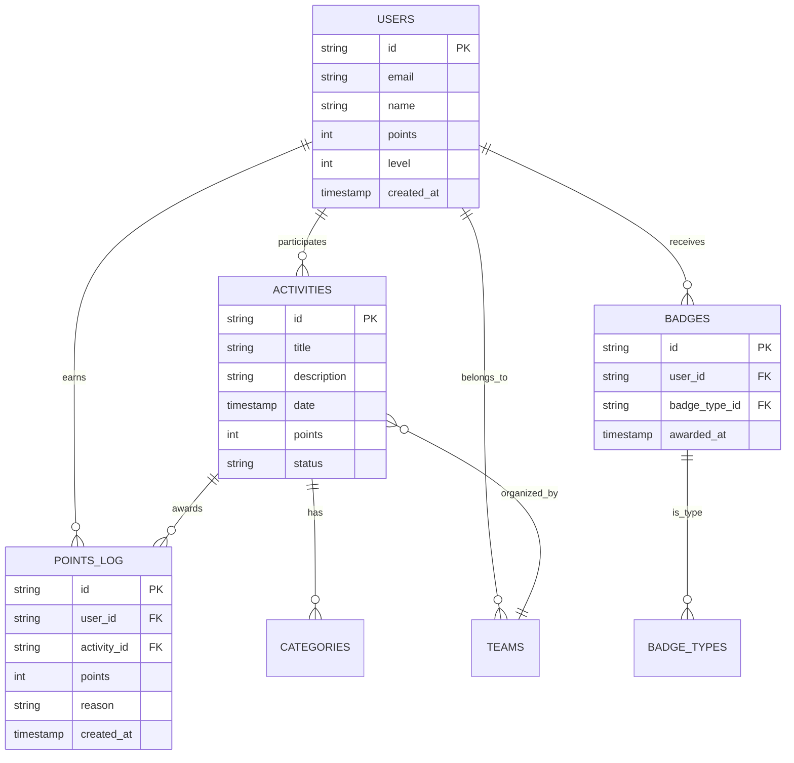

---

## Security Architecture

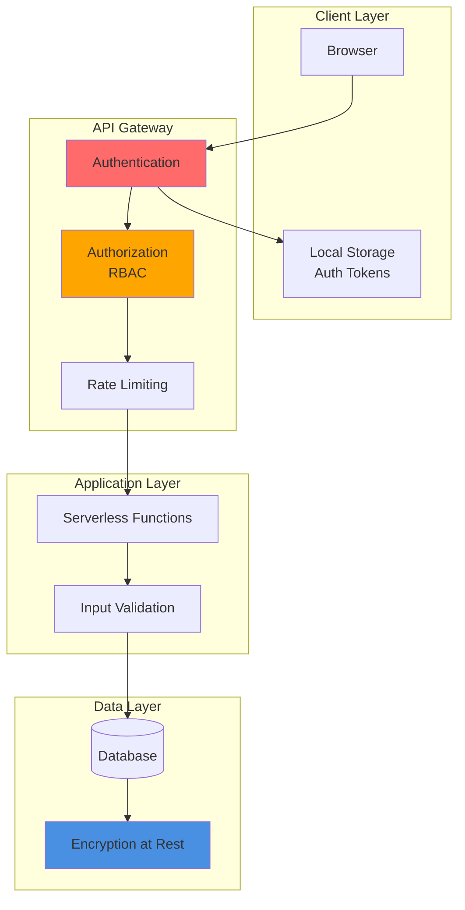

---

## AI Integration Flow

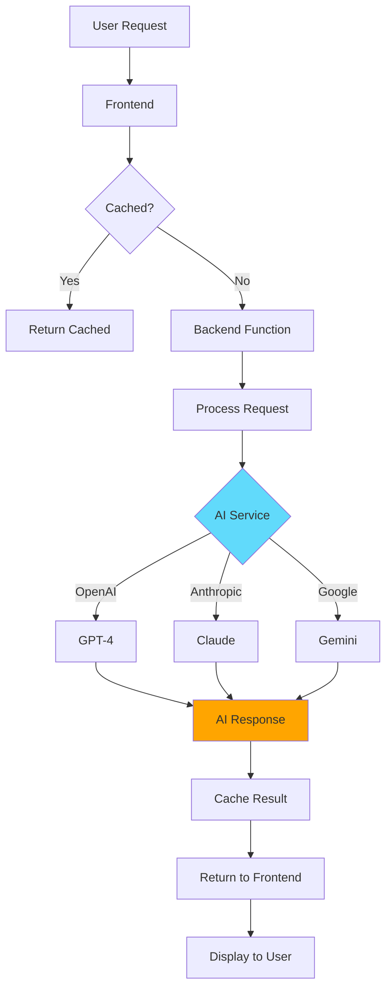

---

## Testing Strategy

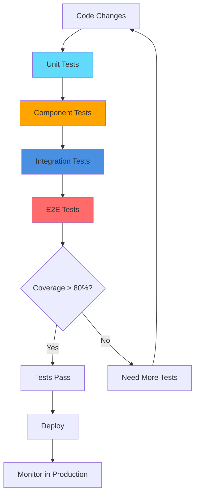

---

## Documentation Structure

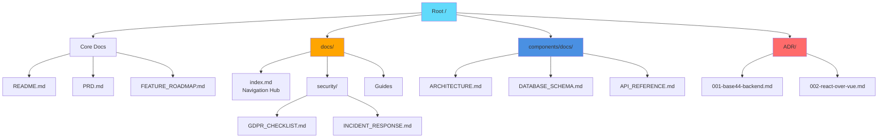

---

## Resources

- **[Complete System Architecture](../components/docs/COMPLETE_SYSTEM_ARCHITECTURE.md)** - Detailed architecture documentation
- **[Database Schema](../components/docs/DATABASE_SCHEMA_TECHNICAL_SPEC.md)** - Complete database design
- **[API Reference](../components/docs/API_REFERENCE.md)** - API documentation
- **[Data Flow](./DATA-FLOW.md)** - Data flow documentation

---

**Last Updated:** January 16, 2026  
**Maintained by:** Architecture Team  
**Questions?** Open an issue with the `documentation` label
